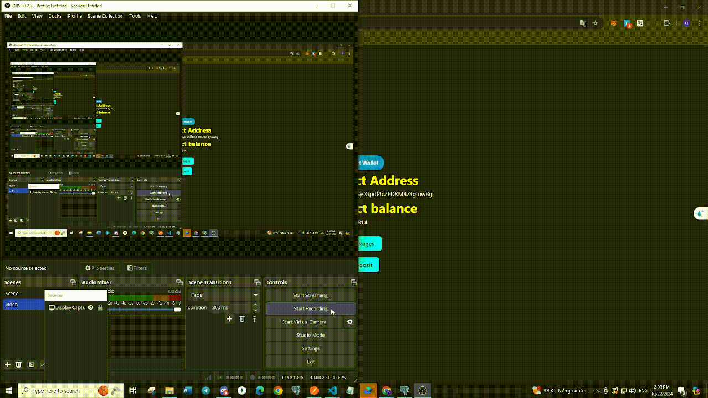

# A basic project built using **FunC smart contract** and **NestJS**.

## Demo Web

https://fun-c-nest-js-flow-of-package-purchase.vercel.app/

## Test smart contract

## Deploy smart contract

## Connect Tonkeeper

# Front End

## Send deposit

## Buy package

# Back End

## Send deposit

## Buy package

